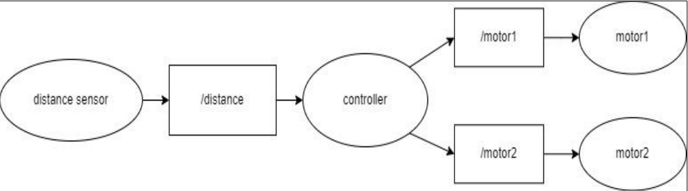

# ROS Exercise: Robot Rotation Control

This exercise is designed to familiarize students with basic ROS concepts and server-side programming. The project involves simulating a robot that rotates in place and reacts to obstacles based on sensor input. The goal is to implement nodes that handle sensor data, control the robot's movement, and manage the interaction between these components using ROS topics.

## Project Overview

The project simulates a mobile robot equipped with distance sensors that detect obstacles in four directions (front, back, left, and right). The robot adjusts its rotation to keep the nearest obstacle directly behind it. The project uses ROS to create, publish, and subscribe to topics that handle the robot’s control logic.

### Key Concepts:
- **ROS (Robot Operating System)**: A framework for robot software development. It includes tools and libraries for managing nodes, topics, messages, and hardware abstraction.
- **Node**: Each part of the robot’s logic is handled by a separate ROS node.
- **Topics**: Communication between nodes is achieved through topics where messages are published and subscribed to.

## Scenario Description

The robot can rotate in place and has distance sensors that measure the distance to obstacles within a range of 10 cm to 200 cm. The following components are implemented:

### Nodes:
1. **Distance Sensor Node**: 
   - Generates four random distance values (front, back, left, right).
   - Publishes the distance values to a `distance` topic using a custom ROS message.
   
2. **Controller Node**:
   - Subscribes to the `distance` topic to receive the sensor data.
   - Determines the best direction for the robot to rotate based on the distance to the nearest obstacle.
   - If the closest obstacle is not behind the robot, the controller chooses the optimal turning direction (clockwise or counterclockwise).
   - Publishes commands for the robot’s motors in the form of a custom message.

3. **Motor Node**:
   - Subscribes to the motor command topic.
   - Uses `loginfo` to print the received values (rotation degree and direction) to the terminal.

### Behavior:
- The robot rotates in place to ensure the nearest obstacle is directly behind it.
- The controller decides whether the robot should rotate 90° clockwise or 270° counterclockwise based on the position of the nearest obstacle.
- The two motors are controlled to rotate in opposite directions to achieve the desired rotation.

## Graph Overview

The following graph represents the node and topic structure for the system:



## Running the Simulation

### Prerequisites:
- ROS installed on your system. Follow the [ROS installation guide](http://wiki.ros.org/ROS/Installation) to set up the necessary environment.

### Running the Nodes:
To run the nodes for this project, use the following commands:
```bash
roslaunch launch/robot_rotation.launch
```

### Displaying the Node Graph:
To verify the nodes and topics are functioning correctly, run:
```bash
rqt_graph
```

### Output:
The terminal output will display the sensor values and motor commands. The final graph should resemble the graph overview shown above

## License

This project is licensed under the [MIT License](LICENSE).
