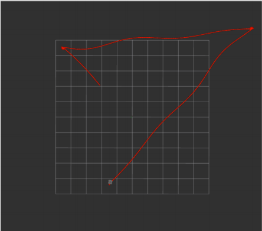
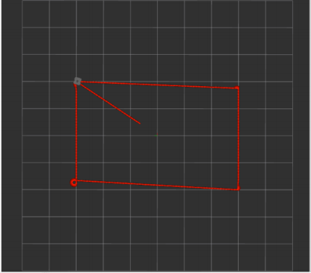
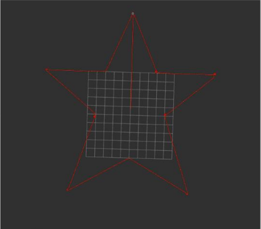
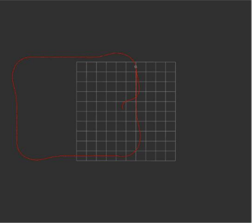

# Robotic Control Algorithms: Path Following and Wall Avoidance

---

## Project Overview

This project is designed to implement control algorithms in ROS (Robot Operating System) for a mobile robot. The main objective is to simulate the robot’s movement using PID control and follow various paths, including a rectangular path, a star-shaped path, and a logarithmic spiral. Additionally, wall-following behavior is implemented using the robot’s laser sensors.

---

## Task Breakdown

### Task 1 - Implementing PID Control for Path Following

- **Goal:** The first part of this task involves using PID control to guide the robot from a starting point to a destination. 
- **Methods:** 
  - A PID controller was applied to adjust the robot's movement. 
  - Three variations of control were implemented: using P, PD, and PID controllers.
  - The robot's position was updated, and the results of each variation were documented in the report.

- **Outcome:** The robot successfully moved between two points using the defined controllers. The performance of the controllers was evaluated by comparing the precision of the movement.

### Task 2 - Random Destination Generation and Robot Control

- **Goal:** A mission node was created to generate random target destinations. The robot moved toward these targets based on feedback from a PID controller.
- **Methods:** 
  - Two nodes were created:
    - **Mission Node:** Generates random destinations for the robot.
    - **Control Node:** Controls the robot’s movement based on the PID controller.
  - The robot requested new destinations once it reached the threshold defined in the exercise.

- **Outcome:** The robot successfully followed four consecutive random destinations, demonstrating the efficiency of the control mechanism.

### Task 3 - Path Following

- **Goal:** The robot followed predefined paths, including:
  1. A rectangular path.
  2. A star-shaped path.
  3. A logarithmic spiral.
- **Methods:** 
  - The controller was designed to handle these paths, and the robot navigated the routes while maintaining proximity to the shape's borders.
  
- **Outcome:** The robot successfully followed the specified paths, and visual representations of the movements were captured in the simulation.

### Wall Following Algorithm

- **Goal:** Implement a basic wall-following algorithm using a LaserScan sensor. The robot should maintain a consistent distance from the wall on its right side.
- **Methods:** 
  - A right-side wall-following algorithm was developed, ensuring the robot adjusted its movement whenever it detected obstacles on the right.

- **Outcome:** The robot correctly followed the wall while avoiding obstacles, with smooth movements based on its sensor input.

---

## Results and Graphs

### Task 2 - Random Destination Paths

The robot’s movement along four random destinations was successful. Below are the visual results from the simulation:

---

### Task 3 - Path Following Results

The robot followed the specified rectangular, star-shaped, and logarithmic spiral paths with precision. The following images showcase the robot's performance for each path:
 
- **Rectangular Path**  
  
  
- **Star-Shaped Path**  
  
  
- **Logarithmic Spiral Path**  
  

---

### Wall-Following Algorithm Results

The following image illustrates the robot’s performance using the wall-following algorithm, where it maintained a consistent distance from the wall and avoided obstacles:

---

